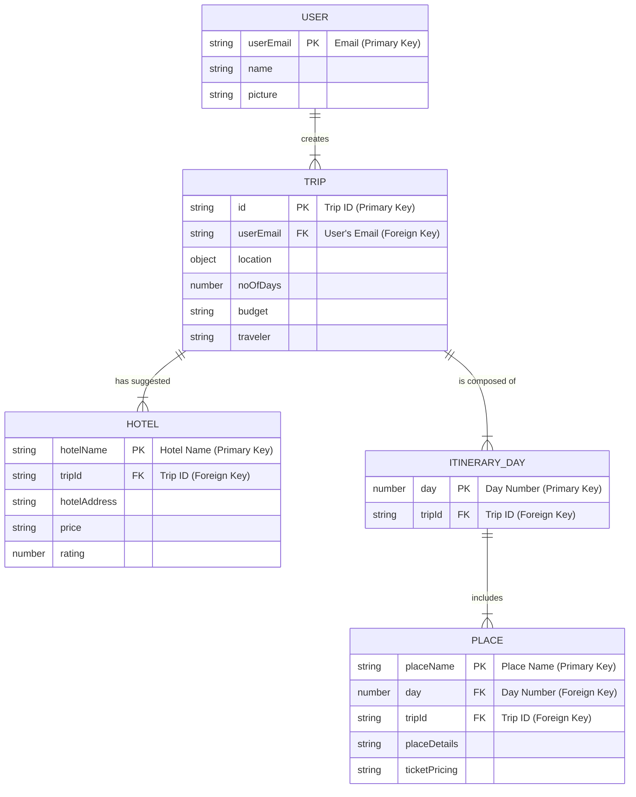

## ER Diagram 

This diagram uses Crow's Foot notation to clearly define the relationships and cardinality between entities.

## Entities and Attributes

Here is a detailed breakdown of each entity's attributes.

### 1. User
| Attribute | Data Type | Description |
| :--- | :--- | :--- |
| **userEmail** | `String` | **Primary Key.** The unique email address of the user. |
| name | `String` | The user's full name. |
| picture | `String` | URL to the user's profile picture. |

### 2. Trip
| Attribute | Data Type | Description |
| :--- | :--- | :--- |
| **id** | `String` | **Primary Key.** A unique identifier for the trip. |
| *userEmail* | `String` | **Foreign Key.** References the `User`. |
| location | `Object` | The destination of the trip. |
| noOfDays | `Number` | The duration of the trip in days. |
| budget | `String` | The user's budget for the trip. |
| traveler | `String` | The number or type of travelers. |

### 3. Hotel
| Attribute | Data Type | Description |
| :--- | :--- | :--- |
| **hotelName** | `String` | **Primary Key.** The name of the hotel. |
| *tripId* | `String` | **Foreign Key.** References the `Trip`. |
| hotelAddress | `String` | The physical address of the hotel. |
| price | `String` | The price range of the hotel. |
| rating | `Number` | The hotel's rating. |

### 4. ItineraryDay
| Attribute | Data Type | Description |
| :--- | :--- | :--- |
| **day** | `Number` | **Primary Key.** The day number of the itinerary. |
| *tripId* | `String` | **Foreign Key.** References the `Trip`. |

### 5. Place
| Attribute | Data Type | Description |
| :--- | :--- | :--- |
| **placeName** | `String` | **Primary Key.** The name of the place. |
| *day* | `Number` | **Foreign Key.** References the `ItineraryDay`. |
| *tripId* | `String` | **Foreign Key.** References the `Trip`. |
| placeDetails | `String` | A description of the place. |
| ticketPricing | `String` | Information about ticket prices. |
