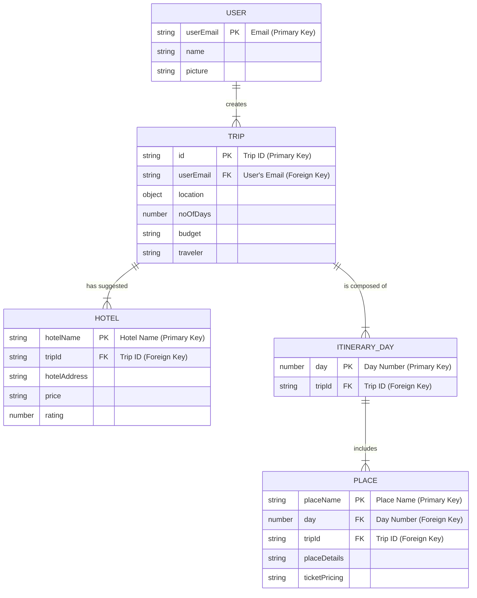

# ER Diagram for the AI Travel Planner

This document provides a comprehensive Entity-Relationship (ER) diagram for the AI Travel Planner application. It is designed to be clear, professional, and suitable for technical discussions or interviews.

## How to Explain This Diagram in an Interview

When presenting this diagram, you can walk through it with the following narrative:

"This ER diagram illustrates the data model for the AI Travel Planner. The architecture is centered around the **USER**, who initiates the process.

1.  A **USER** can create one or many **TRIPs**. This is a one-to-many relationship. The `userEmail` in the `TRIP` entity is a foreign key that links back to the `USER`.

2.  Each **TRIP** is a central entity that holds the user's high-level planning details, such as `location`, `budget`, and `duration`.

3.  For each **TRIP**, the system suggests multiple **HOTELs**. This is another one-to-many relationship, linked by the `tripId`.

4.  A **TRIP** is broken down into a series of **ITINERARY_DAYs**, representing the daily schedule. This is a one-to-many relationship, also linked by `tripId`.

5.  Finally, each **ITINERARY_DAY** contains multiple **PLACEs** to visit. This is the most granular part of the plan and is linked to both the `ITINERARY_DAY` and the parent `TRIP`.

This normalized structure ensures data integrity, avoids redundancy, and allows for efficient querying. For example, we can easily retrieve all trips for a user, or all places for a specific day of a trip."

## ER Diagram (Interview Standard)

This diagram uses Crow's Foot notation to clearly define the relationships and cardinality between entities.

## Entities and Attributes

Here is a detailed breakdown of each entity's attributes.

### 1. User
| Attribute | Data Type | Description |
| :--- | :--- | :--- |
| **userEmail** | `String` | **Primary Key.** The unique email address of the user. |
| name | `String` | The user's full name. |
| picture | `String` | URL to the user's profile picture. |

### 2. Trip
| Attribute | Data Type | Description |
| :--- | :--- | :--- |
| **id** | `String` | **Primary Key.** A unique identifier for the trip. |
| *userEmail* | `String` | **Foreign Key.** References the `User`. |
| location | `Object` | The destination of the trip. |
| noOfDays | `Number` | The duration of the trip in days. |
| budget | `String` | The user's budget for the trip. |
| traveler | `String` | The number or type of travelers. |

### 3. Hotel
| Attribute | Data Type | Description |
| :--- | :--- | :--- |
| **hotelName** | `String` | **Primary Key.** The name of the hotel. |
| *tripId* | `String` | **Foreign Key.** References the `Trip`. |
| hotelAddress | `String` | The physical address of the hotel. |
| price | `String` | The price range of the hotel. |
| rating | `Number` | The hotel's rating. |

### 4. ItineraryDay
| Attribute | Data Type | Description |
| :--- | :--- | :--- |
| **day** | `Number` | **Primary Key.** The day number of the itinerary. |
| *tripId* | `String` | **Foreign Key.** References the `Trip`. |

### 5. Place
| Attribute | Data Type | Description |
| :--- | :--- | :--- |
| **placeName** | `String` | **Primary Key.** The name of the place. |
| *day* | `Number` | **Foreign Key.** References the `ItineraryDay`. |
| *tripId* | `String` | **Foreign Key.** References the `Trip`. |
| placeDetails | `String` | A description of the place. |
| ticketPricing | `String` | Information about ticket prices. |
